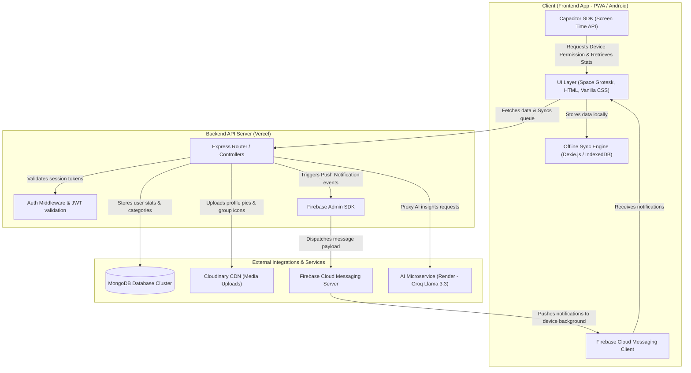
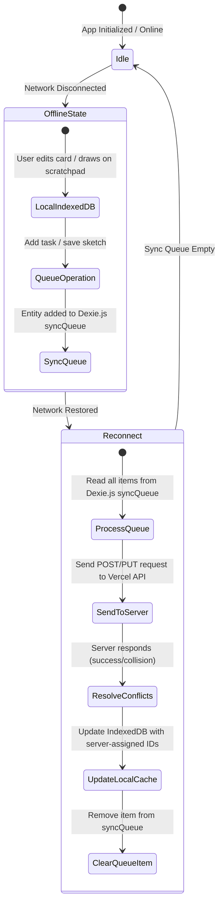

<div align="center">

# ⚡ Consistency Tracker ⚡
### Keep Streaks. Block Distractions. Crushing Goals.
**A premium, offline-first personal productivity and squad accountability hub.**

[](#)
[](#)
[](#)
[](#)
[](#)

---

### [🚀 Live Web App](https://consistency-daily.vercel.app) &nbsp;&bull;&nbsp; [📱 Download Android APK](https://raw.githubusercontent.com/BIKRAM-GORAI/consistency-daily-apk/main/Consistency.Daily.apk)

</div>

---

## 📖 Table of Contents
- [✨ Core Features](#-core-features)
- [🏗️ System Architecture](#%EF%B8%8F-system-architecture)
- [🔄 Offline Synchronization Engine](#-offline-synchronization-engine)
- [🛠️ Tech Stack](#%EF%B8%8F-tech-stack)
- [💻 Local Installation Guide](#-local-installation-guide)
- [🤝 Contributing Guidelines](#-contributing-guidelines)
- [🔒 Security & Sensitive Configs](#-security--sensitive-configs)

---

## ✨ Core Features

| Feature | Description | Platform |
| :--- | :--- | :--- |
| **📅 Daily Habit Cards** | Organize tasks in customizable categories. Visually track daily completion percentages. | Web & Android |
| **🔥 Streak System** | Keep your streaks alive by completing at least one productive task every day. | Web & Android |
| **📱 Screen Time & Focus** | Native Android access permission to track screen times for distracting apps. Flags over-limits directly in daily logs. | **Android Only** |
| **🤖 AI Productivity Summaries** | Generate daily, 7-day, or 30-day productivity coach reviews using Groq (Llama 3.3) summaries. | Web & Android |
| **💬 Squad Group Chat** | Real-time chats, voice messages, images, and stickers to keep your accountability squads synchronized. | Web & Android |
| **🔔 Live Push Notifications** | Receive instant squad messages via Firebase Cloud Messaging (FCM) even when the app is fully closed. | **Android Only** |
| **🎨 Built-in Scratchpad** | Canvas scratchpad for daily logs. Draw sketches, scribble ideas, and replay drawings with time-lapse animations. | Web & Android |
| **💻 LeetCode Integration** | Bind LeetCode account, solve challenges, and auto-verify to log as completed tasks. | Web & Android |

---

## 🏗️ System Architecture

Consistency Tracker is divided into a lightweight frontend application, a serverless Express backend API, and a dedicated AI microservice. Below is the data flow topology.



---

## 🔄 Offline Synchronization Engine

To deliver a reliable mobile experience, Consistency Tracker leverages an offline-first **Stale-While-Revalidate** state machine powered by **Dexie.js (IndexedDB)**.



---

## 🛠️ Tech Stack

- **Frontend:** HTML5, Vanilla JavaScript (ES Modules), Vanilla CSS (Neo-Brutalist Theme), GSAP, Dexie.js
- **Backend:** Node.js, Express, MongoDB (Mongoose), Firebase Admin SDK (Chat/FCM)
- **AI Microservice:** Express, Groq API (Llama 3.3 model), Hosted on Render
- **Mobile Wrapper:** Capacitor SDK
- **Media Hosting:** Cloudinary
- **Deployment:** Vercel (Main Server), Render (AI Service)

---

## 💻 Local Installation Guide

Follow these steps to run the development environment locally:

### 1. Prerequisites
Ensure you have **Node.js** (v18 or higher) and **MongoDB** (local or Atlas) installed.

### 2. Clone the Repository
```bash
git clone https://github.com/BIKRAM-GORAI/consistency.git
cd consistency
```

### 3. Backend Setup
1. Navigate to the root directory and install dependencies:
   ```bash
   npm install
   ```
2. Copy `.env.example` to `.env` and fill in the required configurations:
   ```bash
   cp .env.example .env
   ```
3. Start the backend developer server (runs on port `5001` by default):
   ```bash
   npm run dev
   ```

### 4. AI Service Setup
1. Navigate to the `ai-service` directory:
   ```bash
   cd ai-service
   npm install
   ```
2. Copy `.env.example` to `.env` and insert your **Groq API Key**:
   ```bash
   cp .env.example .env
   ```
3. Start the AI service microservice (runs on port `5002` by default):
   ```bash
   npm start
   ```

---

## 🤝 Contributing Guidelines

We encourage open-source contributions! To help us keep the code clean and maintainable:

1. **Fork the Repository** and create a feature branch (`git checkout -b feature/amazing-feature`).
2. **Aesthetic Compliance:** Consistency Tracker strictly implements a **Neo-Brutalist** style design system:
   - High-contrast colors (`--yellow: #FFD60A`, `--pink: #FF3EA5`, `--lime: #B5FF4D`, `--teal: #00C9A7`, `--coral: #FF6B35`).
   - Thick black borders (`4px solid #000000`).
   - Flat colored shadows (`box-shadow: 8px 8px 0px #000000`).
   - Typography: **Space Grotesk** (headings) and **Inter** (body text).
3. **No Framework Bloat:** Do not introduce Tailwind, bootstrap, React, or Vue. We keep page speeds lightning-fast by using standard, clean vanilla JavaScript modules.
4. **Testing:** Verify changes locally by running `npm run dev` before creating a Pull Request.

---

## 🔒 Security & Sensitive Configs

- All database connection secrets, Cloudinary tokens, JWT signing secrets, and Firebase Admin credentials are kept strictly in the `.env` file (excluded from version control via `.gitignore`).
- For public APIs, a shared API verification token (`AI_SERVICE_SECRET`) secures connection channels between the main backend and the AI microservice.
- Admin portal logins are additionally secured with time-expiring One-Time Passwords (OTPs).
