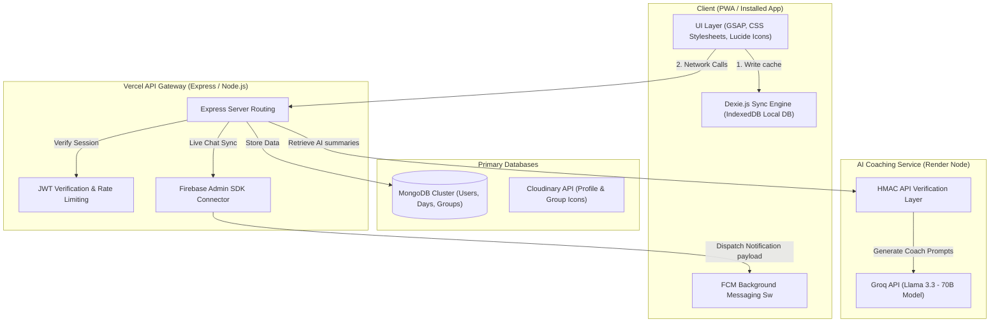
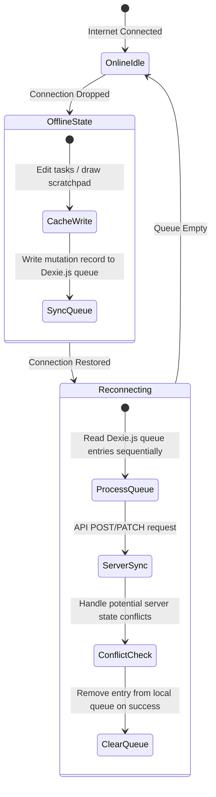

# <div align="center"><span style="color: #2563eb;">⚡ Consistency Daily ⚡</span><br><sub>Habit Tracking &bull; Distraction Blocking &bull; Squad Accountability &bull; AI Coaching</sub></div>

---

<div align="center">

[](#)
[](#)
[](#)
[](#)

### [🚀 Live Web App](https://consistency-daily.vercel.app) &nbsp;&bull;&nbsp; [📱 Download Android APK](https://raw.githubusercontent.com/BIKRAM-GORAI/consistency-daily-apk/main/Consistency.Daily.apk)

</div>

---

## 📖 Table of Contents
- [✨ Core Features](#-core-features)
- [🎨 Beautiful UI Themes](#-beautiful-ui-themes)
- [🏗️ System Architecture](#️-system-architecture)
- [🔄 Offline Synchronization Engine](#-offline-synchronization-engine)
- [🛠️ Tech Stack & Technologies](#️-tech-stack--technologies)
- [💻 Local Installation Guide](#-local-installation-guide)
- [🔒 Security & Sensitive Configs](#-security--sensitive-configs)
- [🤝 Contributing Guidelines](#-contributing-guidelines)

---

## ✨ Core Features

<table>
  <tr>
    <td width="30%"><strong>📅 Daily Habit Cards</strong></td>
    <td>Log habits dynamically inside custom task lists. View daily completion percentages with rich progress rings.</td>
  </tr>
  <tr>
    <td><strong>🔥 Streaks & Milestones</strong></td>
    <td>Log tasks daily to keep streaks active. Highlights milestone cards with specialized styling (indigo/lavender for 7-day wraps and pink/gold for 30-day elite logs).</td>
  </tr>
  <tr>
    <td><strong>🎨 Time-Lapse Scratchpad</strong></td>
    <td>Sketch concepts on a dedicated canvas scratchpad. Save drawings offline and replay drawing logs using custom animated speed controls.</td>
  </tr>
  <tr>
    <td><strong>💬 Squad Chat & Direct Messages</strong></td>
    <td>Real-time chat rooms and direct messages with text formatting, stickers, image sharing, and online presence tracking.</td>
  </tr>
  <tr>
    <td><strong>🤖 Groq AI Summary Coach</strong></td>
    <td>Extract daily task performance, distraction metrics, and streaks to generate custom coach advice powered by Llama 3.3.</td>
  </tr>
  <tr>
    <td><strong>💻 LeetCode Integration</strong></td>
    <td>Link LeetCode user accounts to auto-verify solved challenge stats and check off corresponding habit cards automatically.</td>
  </tr>
  <tr>
    <td><strong>🔔 Live Push Notifications</strong></td>
    <td>Receive squad notifications instantly on your device via Firebase Cloud Messaging (FCM) even when the app is closed.</td>
  </tr>
</table>

---

## 🎨 Beautiful UI Themes

Consistency Daily ships with **4 custom UI layouts** to suit any aesthetic preference:

* <span style="background-color: #ffd60a; color: #000; padding: 2px 6px; border: 2px solid #000; font-weight: bold; border-radius: 4px;">Neo-Brutalist Light</span>: High-contrast layout featuring raw bold borders (`4px solid #000`), flat drop-shadows, and primary retro highlights.
* <span style="background-color: #1e1e1e; color: #fff; padding: 2px 6px; border: 2px solid #333; font-weight: bold; border-radius: 4px;">Dark Mode</span>: Sleek dark obsidian elements with high-contrast pastel text overlays to minimize eye strain.
* <span style="background-color: #ffffff; color: #000; padding: 2px 6px; border: 2px solid #ccc; font-weight: bold; border-radius: 4px;">Minimalistic</span>: High-fashion, low-noise layout featuring ultra-thin lines, spacious margins, and pure monochrome structure.
* <span style="background-color: #e8f7ef; color: #105032; padding: 2px 6px; border: 2px solid #b5e2c9; font-weight: bold; border-radius: 4px;">Claymorphism Mode</span>: Premium pastel gradients combined with inner glassmorphic highlights and soft outer depth.
  * **Weekly wrap-up cards** feature specialized Indigo-to-Lavender gradients (`#e0e7ff` &rarr; `#f3e8ff`).
  * **Monthly elite summary cards** feature Pink-to-Gold gradients (`#fce7f3` &rarr; `#fae8ff` &rarr; `#ffedd5`).

---

## 🏗️ System Architecture

Consistency Daily is designed as a secure, distributed application. The architecture separates client storage, web/app execution, and background workers to ensure lightning-fast loading speeds.

### Architecture Topology



---

## 🔄 Offline Synchronization Engine

To support offline capability, the application runs a state-machine that logs edits locally and reconciles with the database once the internet connection returns.

### Sync Lifecycle Flow



---

## 🛠️ Tech Stack & Technologies

### <span style="color: #2563eb;">Frontend Core</span>
* **HTML5 / Vanilla JavaScript**: Modular ES6 modules for optimized loading without framework overhead.
* **Vanilla CSS**: Neo-brutalist, Claymorphic, and Dark systems driven by CSS variables and utility variables.
* **Dexie.js (IndexedDB)**: Wrapper providing query capabilities for caching tasks, scratchpads, and profiles.
* **GSAP (GreenSock)**: Micro-interaction animations and custom transition libraries.

### <span style="color: #0d9488;">Backend Core</span>
* **Node.js & Express**: API layer handling routing, authentication, and database requests.
* **Mongoose & MongoDB**: Object modeling schema mapping to Mongo collections.
* **Firebase Suite**: Real-time Firebase Firestore database for instant chat messaging and direct chats.

### <span style="color: #b45309;">Integrations</span>
* **Groq API & Llama 3.3**: High-speed LLM integration proxying structured summaries from user metrics.
* **Firebase Cloud Messaging (FCM)**: Real-time native push engine with service worker hooks.
* **Cloudinary SDK**: Remote media hosting with optimization constraints.

---

## 💻 Local Installation Guide

### 1. Prerequisites
Install **Node.js** (v18+) and **MongoDB** (Local Community Server or Atlas URL).

### 2. Clone Project
```bash
git clone https://github.com/BIKRAM-GORAI/consistency.git
cd consistency
```

### 3. Server Setup
Install dependencies in the root directory:
```bash
npm install
```
Configure `.env` environment variables using `.env.example`:
```ini
PORT=5001
MONGO_URI=your_mongodb_connection_string
JWT_SECRET=your_jwt_signing_key
CLOUDINARY_CLOUD_NAME=your_cloudinary_cloud_name
CLOUDINARY_API_KEY=your_cloudinary_api_key
CLOUDINARY_API_SECRET=your_cloudinary_api_secret
FIREBASE_SERVICE_ACCOUNT_JSON=escaped_firebase_service_account_json_content
AI_SERVICE_SECRET=your_shared_hmac_secret
AI_SERVICE_URL=http://localhost:5002
```
Start the development server:
```bash
npm run dev
```

### 4. AI Coaching Service Setup
Navigate to the `ai-service` folder:
```bash
cd ai-service
npm install
```
Create `.env` inside `ai-service` using the keys:
```ini
PORT=5002
GROQ_API_KEY=your_groq_llama_key
AI_SERVICE_SECRET=your_shared_hmac_secret
```
Run the service:
```bash
npm start
```

---

## 🔒 Security & Sensitive Configs

* **Session Validation**: All data-modification routes require cryptographic JSON Web Tokens (JWT) signed using a server-side secret.
* **AI Service Handshake**: The main Express backend and the AI coaching microservice authenticate requests using an **HMAC (Hash-based Message Authentication Code)** signature generated from a shared `AI_SERVICE_SECRET`.
* **Database Sanitization**: Inputs are sanitized against XSS and Mongo Injection vectors. Route access is guarded by `express-rate-limit` limits.

---

## 🤝 Contributing Guidelines

We love community updates! To help us keep the code style consistent:

1. **Fork the Repository** and push code to your feature branch (`feature/amazing-feature`).
2. **Brutalist Style Guide**: Keep margins bold, use high-contrast primary buttons, and enforce raw black borders (`4px solid #000`) for regular themes.
3. **No Frameworks**: Keep the source code dependencies clean. Avoid adding large frameworks like React, Vue, TailwindCSS, or Bootstrap.
4. **Offline Preservation**: When modifying models or state transitions, ensure you update Dexie/IndexedDB schemas accordingly to prevent offline cache synchronization collisions.
